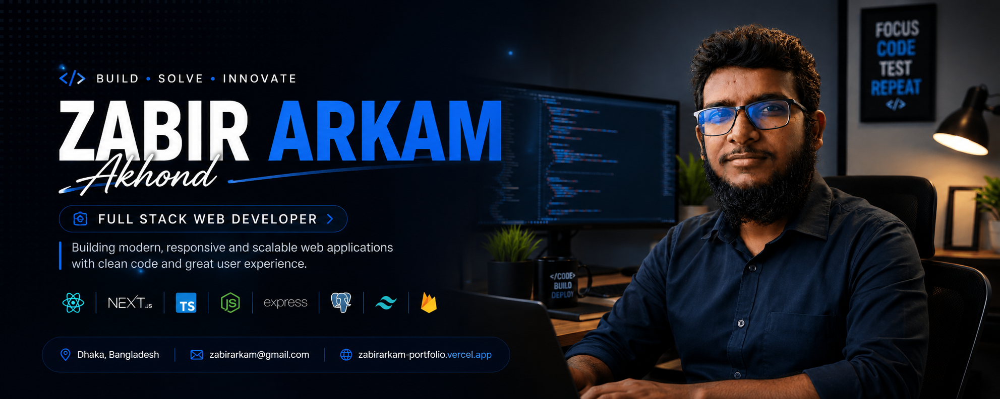

<!-- Banner -->
<p align="center">
  
</p>

<h1 align="center">Hi there 👋, I'm Zabir Arkam Akhond</h1>
<h3 align="center">🚀 Full Stack Web Developer | React • Next.js • TypeScript • Node.js</h3>

<p align="center">
  
</p>

<p align="center">
  <a href="https://zabirarkam-portfolio.vercel.app" target="_blank">
    
  </a>
  <a href="https://www.linkedin.com/in/zabir-arkam-akhond-44373a120/" target="_blank">
    
  </a>
  <a href="https://www.facebook.com/zabir.arkam.1/" target="_blank">
    
  </a>
  <a href="mailto:zabirarkam27@gmail.com">
    
  </a>
</p>

---

### 🙋‍♂️ About Me

I'm a passionate **Full Stack Web Developer** from **Dhaka, Bangladesh 🇧🇩**.
I enjoy turning ideas into modern, responsive, and scalable web applications using today's most popular web technologies. I love learning new tools, improving backend architecture, and creating intuitive user experiences.

```text
const zabir = {
  role: "Full Stack Web Developer",
  stack: ["React", "Next.js", "TypeScript", "Node.js", "PostgreSQL", "Prisma"],
  currentFocus: "Next.js 15 & Full Stack Architecture",
  funFact: "I turn coffee into clean, scalable code ☕"
};
```

### 🚀 Current Activities

-  Learning **Next.js 15**
-  Exploring **PostgreSQL & Prisma**
-  Improving **UI/UX Design**

---

### 💼 Featured Projects

<table>
  <tr>
    <td width="33%">
      <strong>🎓 MentorForge</strong><br/>
      Mentorship platform connecting mentors & mentees.<br/>
      <a href="https://mentor-forge-client.vercel.app/" target="_blank">🔗 Live Demo</a>
    </td>
    <td width="33%">
      <strong>🌾 irri-edu-bd</strong><br/>
      Educational platform for rice farming knowledge.<br/>
      <a href="https://irri-edu-bd.vercel.app/" target="_blank">🔗 Live Demo</a>
    </td>
    <td width="33%">
      <strong>🛒 Prooit</strong><br/>
      Modern e-commerce web application.<br/>
      <a href="https://prooit.com/" target="_blank">🔗 Live Demo</a>
    </td>
  </tr>
</table>

---

### 🛠️ Tech Stack

<p align="center">
  
</p>

---

### 📊 GitHub Stats

<p align="center">
  
  
</p>

<p align="center">
  
</p>

<p align="center">
  
</p>

<p align="center">
  
</p>

---

### 📍 Contact

📍 **Location:** Dhaka, Bangladesh
📧 **Email:** zabirarkam27@gmail.com
🌐 **Portfolio:** [zabirarkam-portfolio.vercel.app](https://zabirarkam-portfolio.vercel.app)

---

<p align="center">
  <i>"Code with purpose. Learn continuously. Build solutions that make an impact."</i>
</p>

<p align="center">
  
</p>
